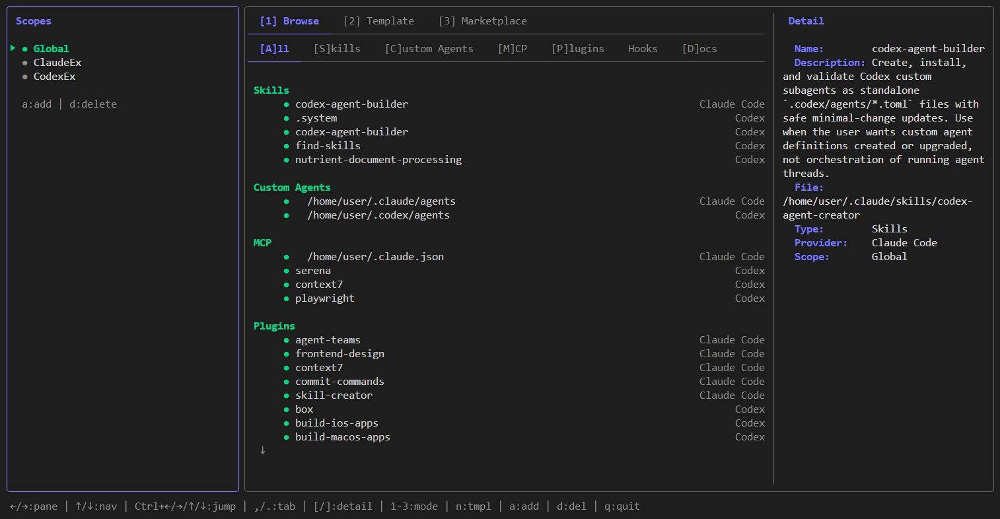

# AgentsBuilder

Claude Code と Codex の設定アセットをターミナル上で一元管理する TUI ツールです。



## ユースケース

- **設定の全体像把握** — Global スコープと Project スコープそれぞれのアセット（Skills・Agents・MCP・Hooks・CLAUDE.md など）を一覧表示
- **優先度の確認** — Global と Project で同名アセットが存在する場合、どちらが優先されているかを差分と合わせて表示
- **テンプレート適用** — 定番の設定セット（`claude-code-basic`、`full-claude` など）を一発でディレクトリ構造ごと展開
- **独自テンプレート作成** — Browse 画面で実ファイルにチェックを入れ、選択内容をテンプレートとして保存・再利用
- **プロジェクト管理** — 複数プロジェクトをアプリ内に登録し、サイドバーで切り替えながら各設定を確認

## 管理対象アセット

| アセット | Claude Code | Codex |
|---------|-------------|-------|
| Skills (コマンド) | `.claude/commands/` | `.codex/commands/` |
| Custom Agents | `.claude/agents/` | `.codex/agents/` |
| MCP 設定 | `.claude.json` | `.codex/config.toml` |
| Plugins | `settings.json` | `.tmp/plugins/` |
| Hooks | `settings.json` | — |
| AGENTS.md | `AGENTS.md` | `AGENTS.md` |
| CLAUDE.md | `CLAUDE.md` | `.codex/CLAUDE.md` |

Global スコープは `~/.claude` / `~/.codex`、Project スコープは各プロジェクトルートを参照します。

## インストール

### ワンライナー（最も簡単）

```bash
curl -fsSL https://raw.githubusercontent.com/zenk-t-suzuki/AgentsBuilder/main/install.sh | sh
```

アーキテクチャ（amd64 / arm64）を自動判別し、最新リリースを `/usr/local/bin/agentsbuilder` にインストールします。

### Go で直接ビルド

```bash
git clone https://github.com/<owner>/AgentsBuilder
cd AgentsBuilder
go build -o agentsbuilder ./cmd/agentsbuilder
sudo mv agentsbuilder /usr/local/bin/
```

Go 1.24 以上が必要です。

### Docker（開発用）

```bash
# ソースを直接マウントして起動
docker compose run --rm dev
```

### Docker（プロダクション）

```bash
# イメージをビルドして起動
docker compose run --rm app

# またはイメージ単体でビルド
docker build -t agentsbuilder .
docker run -it --rm \
  -v ~/.claude.json:/root/.claude.json:ro \
  -v ~/.claude:/root/.claude:ro \
  -v ~/.codex:/root/.codex:ro \
  agentsbuilder
```

## 起動

```bash
agentsbuilder
```

設定ファイルは `~/.agentsbuilder/config.json` に自動生成されます。  
テンプレートは `~/.agentsbuilder/templates/` に保存されます。

## 使い方

### 画面構成

```
┌──────────────┐ ┌─────────────────────────────────────────────────┐
│   Sidebar    │ │              Main Area                          │
│              │ │  [1] Browse  [2] Template  [3] Marketplace      │
│  > Global    │ │  ┌─ Browse Tabs ────────────────────────────┐   │
│    project-A │ │  │ [A]ll [S]kills [C]ustom Agents [M]CP ... │   │
│    project-B │ │  ├─ Asset List ──────────┬─ Detail ─────────┤   │
│              │ │  │                       │                   │   │
│              │ │  │                       │                   │   │
└──────────────┘ └─────────────────────────────────────────────────┘
```

### キーバインド

#### ペイン間移動

| キー | 動作 |
|------|------|
| `Tab` | サイドバー ↔ 直前のメイン要素 を切り替え |
| `←` / `h` | 現在の要素から左隣の要素へ（リスト→サイドバーなど） |
| `→` / `l` | 現在の要素から右隣の要素へ（サイドバー→元の位置など） |
| `↑` / `k` | 上の要素へ（リスト先頭→Browse タブ→Mode タブ） |
| `↓` / `j` | 下の要素へ（Mode タブ→Browse タブ→リスト） |
| `Ctrl+←/→/↑/↓` | 端に関わらず隣接要素へ直接ジャンプ |

#### モード切替

| キー | 動作 |
|------|------|
| `1` | Browse モード |
| `2` | Template モード（テンプレート適用） |
| `3` | Marketplace モード |

#### Browse モード

| キー | 動作 |
|------|------|
| `,` / `.` | Browse 内タブを左右に切り替え |
| `[` / `]` | 詳細パネルをスクロール |
| `Enter` | 選択 |
| `n` | テンプレート作成モード開始 |
| `t` | Template モードへ移動 |

#### サイドバー

| キー | 動作 |
|------|------|
| `↑` / `↓` | スコープ / プロジェクトを選択 |
| `Enter` | 選択したスコープをアクティブ化 |
| `a` | プロジェクトを追加 |
| `d` | プロジェクトを削除 |

#### テンプレート作成（`n` キーで開始）

1. Browse 画面でアセットに `Space` でチェックを入れる（プロジェクトを切り替えながら選択可）
2. `Enter` でレビュー画面へ — 不要なアイテムを `Space` で外す
3. `Enter` でテンプレート名を入力 → `Enter` で保存

保存されたテンプレートは `~/.agentsbuilder/templates/<name>/` に配置され、Template モード（`2`）から適用できます。

#### 共通

| キー | 動作 |
|------|------|
| `Esc` | 戻る / キャンセル |
| `q` | 終了 |
| `Ctrl+C` | 強制終了 |

## カスタムテンプレート（手動追加）

`~/.agentsbuilder/templates/<name>/template.json` を作成することで、アプリ外からもテンプレートを追加できます。

```json
{
  "name": "my-template",
  "description": "My custom setup",
  "assets": ["Skills", "ClaudeMD"],
  "providers": ["ClaudeCode"]
}
```

**assets** に指定できる値: `Skills`, `Agents`, `MCP`, `Plugins`, `Hooks`, `AgentsMD`, `ClaudeMD`  
**providers** に指定できる値: `ClaudeCode`, `Codex`

## 技術スタック

- **言語**: Go 1.24
- **TUI フレームワーク**: [Bubble Tea](https://github.com/charmbracelet/bubbletea)
- **スタイリング**: [Lip Gloss](https://github.com/charmbracelet/lipgloss)
- **対応 OS**: Linux（MVP）
